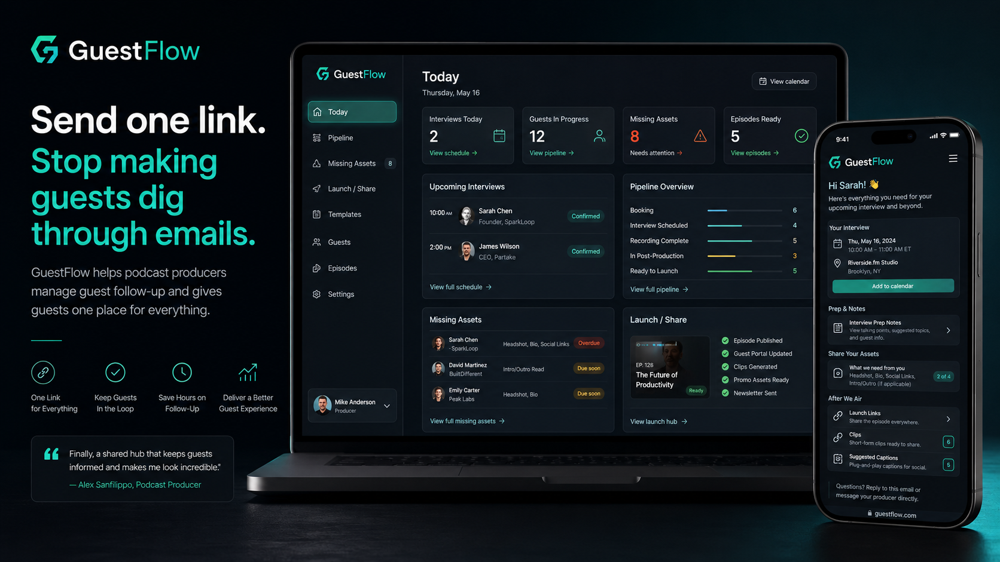

# GuestFlow

**A local-first producer dashboard and guest portal for podcasters, creator collabs, and interview shows.**

> Send one link instead of making busy guests dig through emails.

GuestFlow is the missing layer between guest *booking* tools and guest *recording* tools. It owns the messy middle: onboarding instructions, location and parking details, missing bios and headshots, release forms, launch day reminders, clips and captions, Instagram collab acceptance, and post-launch sharing nudges.



## Why GuestFlow

Most podcast and creator tools focus on **finding** guests, **booking** guests, or **recording** interviews. GuestFlow focuses on everything in between and after:

- Onboarding instructions, location, parking, and prep details
- Missing bio / headshot / social handles / release forms
- Launch day links, clips, captions
- Instagram collab acceptance reminders
- Guest sharing nudges after the episode goes live

The producer sees a clean dashboard. The guest sees one portal link with everything they need.

## Features

- **Producer dashboard** — at-a-glance view of today's prep work
- **Guest pipeline** — kanban-style flow from booked to launched
- **Guest portal preview/editor** — what the guest sees, fully editable
- **Missing assets dashboard** — flag every guest missing a bio, headshot, or handle
- **Launch & share checklist** — post-launch tracking per guest
- **Copyable message templates** — onboarding, reminder, post-launch
- **JSON export/import + CSV export** — own your data
- **localStorage persistence** — no backend, nothing leaves your machine
- **Dark dashboard UI** — easy on the eyes
- **Mock guest data** — explore the workflow without setting anything up

## Tech stack

- React + TypeScript
- Vite
- Plain CSS (no framework)
- localStorage for persistence — no backend, no auth, no telemetry

## Run locally

```bash
npm install
npm run dev
```

## Build

```bash
npm run build
```

## Project structure

```txt
src/
  App.tsx
  types.ts
  data/
    mockGuests.ts
    templates.ts
  lib/
    storage.ts
    dates.ts
    guestLogic.ts
    csv.ts
    slug.ts
  components/
    AppShell.tsx
    Sidebar.tsx
    Footer.tsx
  pages/
    TodayPage.tsx
    PipelinePage.tsx
    GuestPortalPage.tsx
    GuestDetailPage.tsx
    MissingAssetsPage.tsx
    LaunchSharePage.tsx
    TemplatesPage.tsx
    SettingsPage.tsx
```

## Status & scope

This is an intentionally manual, local-first MVP. There is **no** backend, auth, public sharing, Gmail integration, Instagram API, or automatic sending. The guest portal link is a mock/local URL so the workflow can be validated before any hosted portal is built.

## Built by

[Jacob Britten](https://jacobbritten.com) — Media Systems Architect. See more projects at [jacobbritten.com/projects](https://jacobbritten.com/projects.html) and [jacobbritten.com/lab](https://jacobbritten.com/lab.html).

## License

All rights reserved unless a LICENSE file is added.
