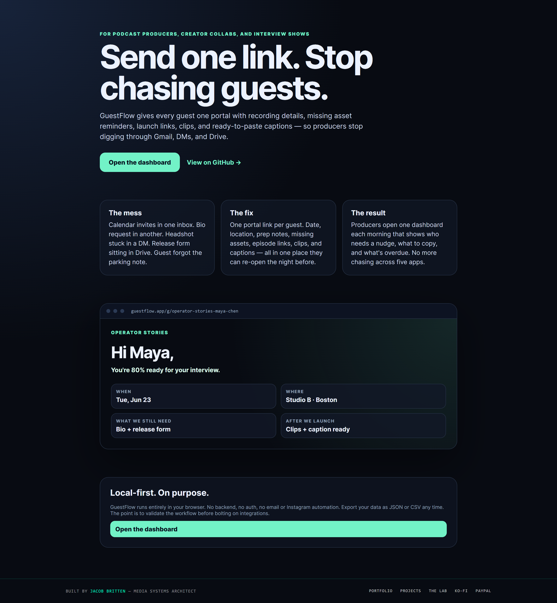
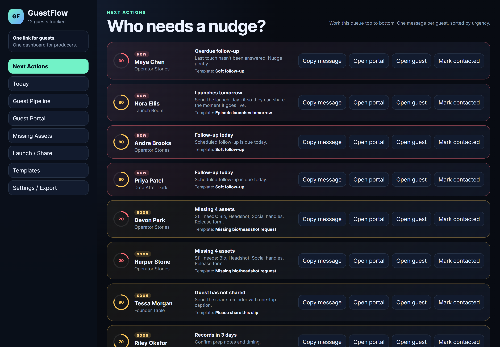
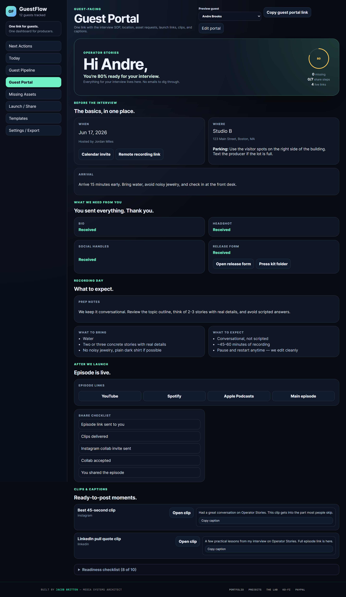
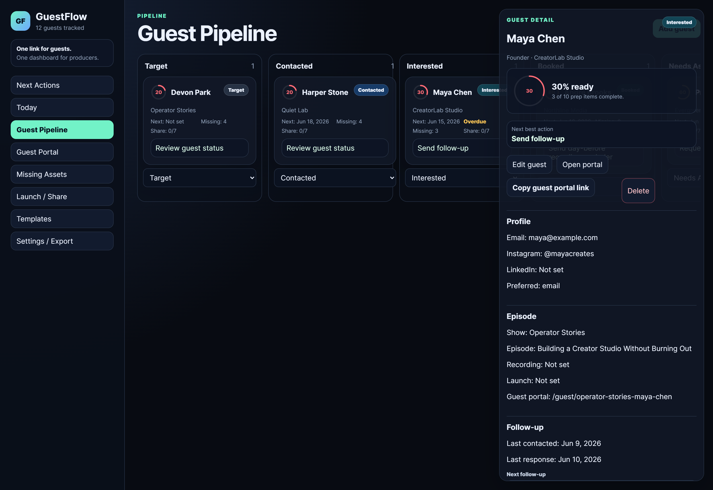

# GuestFlow

**A local-first producer dashboard and guest portal for podcasters, creator collabs, and interview shows.**

> Send one link. Stop chasing guests.

GuestFlow is the missing layer between guest *booking* tools and guest *recording* tools. It owns the messy middle: onboarding instructions, location and parking, missing bios and headshots, release forms, launch-day reminders, clips and captions, Instagram collab acceptance, and post-launch sharing nudges.



## Why GuestFlow

Most podcast and creator tools focus on **finding** guests, **booking** guests, or **recording** interviews. GuestFlow focuses on everything in between and after:

- Onboarding instructions, location, parking, and prep details
- Missing bio / headshot / social handles / release forms
- Launch-day links, clips, captions
- Instagram collab acceptance reminders
- Guest sharing nudges after the episode goes live

The producer sees a focused dashboard. The guest sees one portal link with everything they need.

## What's in the app

### Next Action Queue

The morning view: every guest who needs a nudge, sorted by urgency, with a one-tap "Copy message" pulled from your template library.



### Polished guest portal

One link per guest. Hero with a readiness score and a real greeting, then five sections — *Before the Interview, What We Need From You, Recording Day, After We Launch, Clips & Captions* — so guests can re-open the night before and feel calm.



### Pipeline + Guest Detail

Kanban over twelve stages with a side-panel detail view that surfaces the readiness ring, the next best action, and a copyable portal link.



## Feature list

- Producer dashboard (Today + Next Actions)
- Guest pipeline (kanban, 12 stages)
- Guest detail panel with readiness ring + next-best-action
- Guest portal preview/editor with five guest-facing sections
- Readiness score: 0–100 across recording details, assets, launch links, and sharing
- Show-level defaults that flow into every new guest
- Missing assets dashboard
- Launch & share checklist
- Copyable message templates
- JSON export/import + CSV export
- localStorage persistence — no backend, nothing leaves your machine
- Public welcome route at `?welcome=1`
- Dark dashboard UI

## Tech stack

- React 19 + TypeScript
- Vite 6
- Plain CSS (no framework)
- localStorage for persistence — no backend, no auth, no telemetry

## Run locally

```bash
npm install
npm run dev
```

## Build

```bash
npm run build
```

## Project structure

```txt
src/
  App.tsx
  types.ts
  data/
    mockGuests.ts
    templates.ts
  lib/
    storage.ts
    dates.ts
    guestLogic.ts
    nextActions.ts
    readiness.ts
    showDefaults.ts
    portal.ts
    csv.ts
    slug.ts
  components/
    AppShell.tsx
    Sidebar.tsx
    Footer.tsx
    GuestCard.tsx
    GuestForm.tsx
    CopyLinkButton.tsx
    ReadinessRing.tsx
    StatusPill.tsx
    ChecklistItem.tsx
    TemplateCard.tsx
    EmptyState.tsx
  pages/
    WelcomePage.tsx
    NextActionsPage.tsx
    TodayPage.tsx
    PipelinePage.tsx
    GuestPortalPage.tsx
    GuestDetailPage.tsx
    MissingAssetsPage.tsx
    LaunchSharePage.tsx
    TemplatesPage.tsx
    SettingsPage.tsx
```

## Status & scope

Intentionally manual, local-first MVP. There is **no** backend, auth, public sharing, Gmail integration, Instagram API, or automatic sending. The guest portal link is a mock `https://guestflow.app/g/<slug>` URL so the workflow can be validated before any hosted portal is built. See [GOALS.md](GOALS.md) for the full product vision and [DESIGN_PROMPT.md](DESIGN_PROMPT.md) for the brief that drove the current pass.

## Refresh screenshots

```bash
# Dev server in one shell:
npm run dev -- --port 5180

# Generate screenshots from another shell (requires Chrome at the default Windows path):
npm install --no-save puppeteer-core
node scripts/screenshots.mjs
```

## Built by

[Jacob Britten](https://jacobbritten.com) — Media Systems Architect. See more at [jacobbritten.com/projects](https://jacobbritten.com/projects.html) and [jacobbritten.com/lab](https://jacobbritten.com/lab.html).
